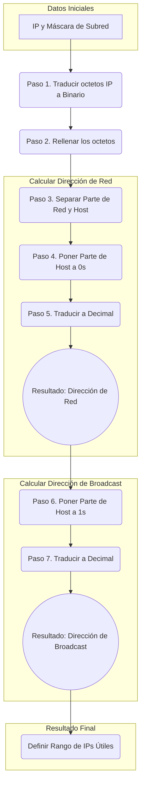

# ⚙️ Guía Práctica de Redes para la Cafetería "El Rincón Digital"

¡Hola, equipo! Bienvenidos a vuestro primer proyecto como técnicos de red. Esta guía es vuestro manual de campo. Consultadla siempre que tengáis dudas. El objetivo es que os sirva de apoyo para que podáis completar la misión con éxito. ¡Vamos a ello!

-----

## 1. Vuestra Misión: El Caso Práctico

El dueño de la cafetería-coworking **"El Rincón Digital"** os ha contratado para diseñar su nueva red. Necesita que sea moderna, rápida y, sobre todo, segura. El "Rincón Digital" juega en otra liga: no es una cafetería cualquiera, es un espacio de trabajo y estudio donde los clientes vienen a disfrutar de un buen café mientras navegan por Internet o trabajan en sus proyectos. Por eso, no vale enchufar un router Wi-Fi de esos todo en uno y ya está. Aquí hay que hacer las cosas bien.

**Vuestro objetivo es diseñar una solución de red que cumpla estos tres requisitos:**

1. **Red Wi-Fi para Invitados:** Debe soportar hasta 100 clientes conectados. La seguridad es clave para que los invitados no puedan acceder a los sistemas internos. Tendrá que ser una red Wi-Fi protegida con contraseña, que permita a los clientes navegar por Internet sin comprometer la seguridad de la cafetería.
2. **Red para Empleados:** Una red privada, separada de los clientes, para unos 20 dispositivos del personal (tablets para comandas, móviles, etc.). Debe ser rápida y permitir la comunicación interna entre los empleados, y su acceso a Internet. Esta red debe estar protegida para que los empleados no puedan acceder a la red de administración.
3. **Red de Administración:** Una red totalmente aislada y de máxima seguridad para el Terminal Punto de Venta (TPV) y el ordenador de contabilidad.

## 2. Checklist del Proyecto (Pasos a Seguir)

Usad esta lista para organizar vuestro trabajo y aseguraros de que no se os olvida nada. Cópiala en un archivo de texto y ve marcando cada tarea a medida que la completéis.

- [ ] **Fase 1: Investigar y Seleccionar Hardware.**
  - [ ] Preparar una lista con los dispositivos necesarios, cantidad y requisitos.
  - [ ] Investigar modelos de Routers, Switches gestionables y Puntos de Acceso que podamos recomendar el cliente.
  - [ ] Elegir el hardware más adecuado para la cafetería y justificar la elección.
  - [ ] Elaborar presupuesto aproximado del hardware seleccionado.
- [ ] **Fase 2: Diseñar la Topología de Red.**
  - [ ] Crear un diagrama de red claro usando `draw.io`.
  - [ ] Indicar cómo se conectan todos los dispositivos y dónde iría cada red (VLAN).
- [ ] **Fase 3: Crear el Plan de Direccionamiento IP.**
  - [ ] Calcular las subredes necesarias para las 3 VLANs.
  - [ ] Asignar rangos de IP a cada red.
- [ ] **Fase 4: Simular la Red.**
  - [ ] Montar vuestro diseño en Cisco Packet Tracer. Utilizar sólo el primer y último host de cada red para simplificar.
  - [ ] Configurar las VLANs y las IPs.
  - [ ] Verificar que hay conectividad dentro de cada red y que están aisladas entre sí.
- [ ] **Fase 5: Redactar el Informe Técnico Final y su presentación.**
  - [ ] Unir toda la información (justificación del hardware, diagrama, plan de IPs) en un único documento.
  - [ ] Preparar pequeña presentación para explicar el proyecto al cliente.

-----

## 3. Los "Hierros" - ¿Qué Hardware Necesitamos?

Todo diseño de red empieza por elegir bien los componentes. Aquí tenéis un resumen de lo que necesitaréis:

### Router

- **Función:** Es la puerta de vuestra red al mundo (Internet). Gestiona todo el tráfico que entra y sale.
- **Para la cafetería:** Necesitaréis uno que sea robusto y que permita configurar las reglas de seguridad (Firewall) entre vuestras redes (aunque en este punto no entraremos a su configuración). Que permita priorizar el tráfico de la red de administración y que tenga capacidad para manejar múltiples VLANs.

### Switch Gestionable (Managed Switch)

- **Función:** Es el "distribuidor" del tráfico dentro de vuestra red. Conecta todos los dispositivos por cable.
- **Para la cafetería:** La palabra clave es **"Gestionable"**. Esto significa que podéis configurarlo para crear las 3 redes separadas (VLANs) que os han pedido.

### Puntos de Acceso (Access Points - APs)

- **Función:** Son los que emiten la señal Wi-Fi. Conectaréis varios al Switch para dar cobertura a toda la cafetería.
- **Para la cafetería:** Necesitaréis APs que puedan gestionar muchos usuarios a la vez (para la red de invitados) y que permitan emitir varias redes Wi-Fi distintas (una para invitados, otra para empleados). Supondremos que con 2 APs de techo será suficiente para cubrir todo el local. Aseguraos de que son compatibles con VLANs y tienen buena capacidad de gestión de usuarios.

## 4. El Plan Maestro: Direccionamiento IP y VLANs (Paso a Paso)

Esta parte parece la más difícil, pero es como un puzzle. Vamos a resolverlo siguiendo un procedimiento claro. El objetivo es que entendáis **cómo funciona**, no que hagáis cálculos de cabeza.

### Herramienta de Apoyo: Calculadora Binario-Decimal

Para facilitar el trabajo, podéis usar una calculadora online.

**Enlace recomendado:** [Calculadora de Binario-Decimal de RapidTables](https://www.rapidtables.com/convert/number/binary-to-decimal.html)

> ⚠️ **Importante:** Usad esta herramienta **solo para pasar de decimal a binario y viceversa**. La lógica del procedimiento la hacéis vosotros con la guía.

### Guía para Calcular una Subred

Sigue estos pasos para cada una de las 3 redes que tienes que crear:

1.  **PASO 1:** Traduce la dirección IP que vas a usar a binario, octeto a octeto.
2.  **PASO 2:** Rellena con ceros (0) a la izquierda si es necesario para que cada octeto tenga 8 bits.
3.  **PASO 3:** Dibuja un "muro" o una línea que separe la parte de red de la parte de host, según la máscara de subred que hayas elegido. **Lo que queda a la izquierda del muro (la parte de red) no se toca.**
4.  **PASO 4:** Sustituye por ceros (0) toda la parte de host (lo que está a la derecha del muro).
5.  **PASO 5:** Vuelve a traducir el número binario resultante a decimal, octeto a octeto.
6.  **PASO 6:** **¡Enhorabuena\! Esa es la Dirección de Red.** (Recuerda: esta es la primera IP y no se puede asignar a ningún equipo).
7.  **PASO 7:** Ahora, coge la dirección binaria original y cambia por unos (1) toda la parte de host. Vuelve a traducir a decimal. **Esa es la Dirección de Broadcast.** (Es la última IP y tampoco se puede usar).
8.  **PASO 8:** Las direcciones IP que puedes usar para tus equipos son todas las que están entre la Dirección de Red y la de Broadcast.

-----

## 5. La Entrega: ¿Qué Debéis Presentar?

Al finalizar la misión, debéis entregar en la tarea de Aules un único archivo `.zip` que contenga:

- **El diagrama de red** (en formato `.png` o `.pdf`).
- **El informe técnico** completo con vuestra propuesta (en formato `.pdf`).

-----

### CC BY-SA 4.0

#### Creative Commons Attribution-ShareAlike 4.0 International
