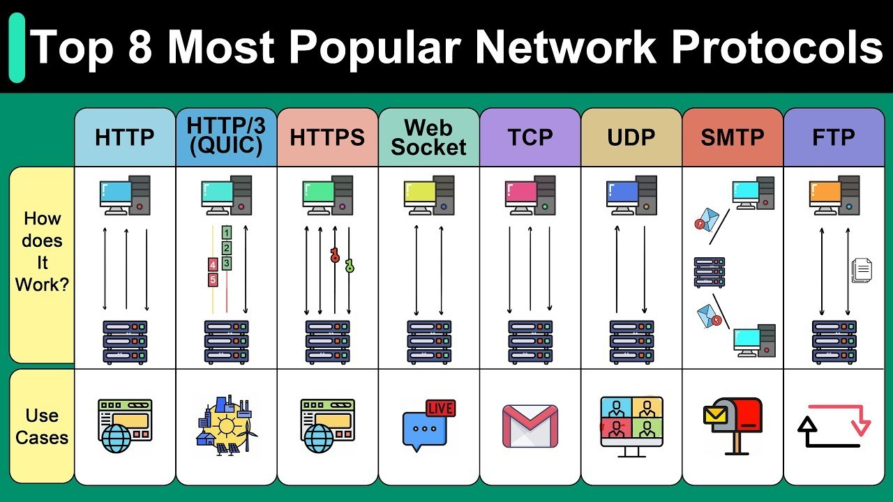

# UP6: La capa de aplicación

## Top 8 protocolos de la capa de aplicación

Fuente: https://www.youtube.com/watch?v=P6SZLcGE4us

### Protocolos de red esenciales en la era digital

Internet es utilizada diariamente por más de 5 mil millones de personas, generando exabytes de datos. Los protocolos de red son los motores ocultos que impulsan este intercambio masivo de información, siendo HTTP la columna vertebral del desarrollo web.

#### HTTP

HTTP utiliza un modelo de solicitud-respuesta, donde los clientes envían solicitudes a los servidores para obtener recursos, y los servidores responden con códigos de estado. HTTP define métodos como GET, POST, PUT y DELETE, que activan diferentes operaciones en el servidor.

#### HTTPS

HTTPS se basa en HTTP, añadiendo cifrado a través de Transport Layer Security (TLS), lo que permite que el navegador y el servidor establezcan una conexión cifrada, manteniendo la confidencialidad de los datos y verificando la identidad del servidor.

#### HTTP/3

HTTP/3 busca mejorar la velocidad y la seguridad. Utiliza QUIC, construido sobre UDP en lugar de TCP, optimizando el rendimiento sin la sobrecarga de TCP, reduciendo el lag al cambiar de red y eliminando el bloqueo de cabecera.

#### QUIC [Capa de Transporte]

QUIC incorpora cifrado por defecto en la capa de transporte, donde todos los datos de conexión están cifrados, no solo la carga útil de la aplicación. Es ideal para aplicaciones modernas en las que cada milisegundo cuenta.

#### WebSocket

WebSocket revoluciona la comunicación en tiempo real, ofreciendo comunicación bidireccional completa en una sola conexión TCP. Facilita la colaboración en tiempo real y flujos de datos en vivo, y admite cifrado mediante TLS para garantizar la seguridad.

#### TCP y UDP [Capa de Transporte]

TCP y UDP forman la base de la capa de transporte para muchos protocolos de aplicación. TCP prioriza la fiabilidad sobre la velocidad bruta, mientras que UDP se centra en la velocidad sobre la fiabilidad. HTTP/3 utiliza UDP mediante el protocolo QUIC.

#### SMTP y FTP

SMTP y FTP proporcionan estándares a nivel de aplicación para el correo electrónico y la transferencia de archivos, respectivamente. SMTP es el estándar para transferir mensajes de correo entre servidores, mientras que FTP permite subir y descargar archivos de manera eficiente entre hosts.

#### Importancia de los protocolos

Comprender estos protocolos populares, incluyendo HTTP, HTTPS, HTTP/3, WebSocket, TCP, UDP, SMTP y FTP, nos permite construir sistemas rápidos y seguros. Es esencial para configurar servicios de correo, evitar problemas y entregar datos de manera eficiente.

## DNS: Sistema de Nombres de Dominio

Fuente: https://www.youtube.com/watch?v=27r4Bzuj5NQ

DNS, o Sistema de Nombres de Dominio, es el directorio de Internet que traduce nombres de dominio legibles para humanos a direcciones IP legibles para máquinas. Es un componente crucial en la columna vertebral de Internet.

La jerarquía DNS se compone de diferentes tipos de servidores DNS, cada uno con una función única, incluyendo resolutores DNS, servidores raíz, servidores de nombres de dominio de nivel superior (TLD) y servidores de nombres autoritativos para dominios.

Cuando un navegador realiza una consulta DNS, solicita ayuda a un resolutor DNS, que puede ser proporcionado por un proveedor de servicios de Internet (ISP) o servicios populares como Cloudflare (1.1.1.1) o Google (8.8.8.8). Si el resolutor no tiene la respuesta en su caché, encuentra el servidor de nombres autoritativo correcto y le solicita la información.

El servidor de nombres autoritativo contiene la respuesta a la consulta DNS. Cuando se actualizan los registros DNS de un dominio, su servidor de nombres autoritativo también se actualiza.

El resolutor DNS encuentra el servidor de nombres autoritativo a través de un sistema de tres niveles principales de servidores DNS autoritativos: servidores raíz, servidores de nombres TLD y servidores de nombres autoritativos para dominios.

Los servidores raíz almacenan las direcciones IP de los servidores de nombres TLD. Hay 13 servidores raíz lógicos, cada uno con una dirección IP única asignada y múltiples servidores físicos detrás de cada dirección IP.

Los servidores de nombres TLD almacenan las direcciones IP de los servidores de nombres autoritativos para todos los dominios bajo su nivel. Existen muchos tipos de TLD, incluyendo .com, .org, .edu, y TLDs de código de país como .de y .uk.

Los servidores de nombres autoritativos para un dominio proporcionan respuestas definitivas a las consultas DNS. Cuando se registra un dominio, el registrador utiliza servidores de nombres autoritativos por defecto, pero pueden ser cambiados a otros, como los operados por proveedores en la nube como AWS y Cloudflare.

El diseño jerárquico de DNS lo hace altamente descentralizado y robusto. La vida de una consulta DNS típica incluye que el usuario escriba un nombre de dominio en un navegador, el navegador revise su caché y luego realice una llamada al sistema operativo para intentar obtener la respuesta, lo que puede implicar contactar con el resolutor DNS, el servidor raíz, el servidor de nombres TLD y finalmente el servidor de nombres autoritativo del dominio.

Al actualizar los registros DNS para un sistema de producción activo y de alto tráfico, es esencial considerar la propagación DNS, que puede ser lenta debido al tiempo de vida (TTL) de cada registro DNS. Para mitigar este riesgo, se recomienda reducir el TTL del registro a cambiar a un tiempo corto, como 60 segundos, con suficiente antelación a la actualización, y mantener el servidor funcionando en la dirección IP antigua por un tiempo después de la actualización.

## DHCP

https://www.youtube.com/watch?v=K07wzpcKrsk

El protocolo DHCP es un protocolo de capa de aplicación que nos permite automatizar el proceso de configuración TCP/IP de un equipo, lo que facilita la conexión de nuevos equipos a la red.

El protocolo DHCP se utiliza para asignar automáticamente la configuración TCP/IP a un equipo cuando se conecta a una red, lo que evita la necesidad de configurar manualmente los valores de IP, máscara de red, etc.

La finalidad del protocolo DHCP es automatizar el proceso de configuración TCP/IP, lo que puede ser especialmente útil en redes grandes o complejas, aunque en redes pequeñas, como una red doméstica, su uso puede no suponer una gran ventaja.

El protocolo DHCP es utilizado en las redes IP de hoy en día y nos permite conectar nuevos equipos a la red de manera automática, sin necesidad de intervención humana.

La configuración TCP/IP es necesaria para que un equipo pueda comunicarse con otros elementos de la red, y el protocolo DHCP nos permite obtener esta configuración de manera automática.

El uso del protocolo DHCP puede ser especialmente útil en entornos donde se conectan y desconectan frecuentemente equipos de la red, como en una red de empresa o en un entorno de red inalámbrica.

La configuración de dispositivos es una tarea relativamente rápida y sencilla que normalmente solo se realiza una vez para cada dispositivo y esto nos servirá durante años.

En un escenario con una red mediana o grande, como el de una empresa o una corporación, la configuración de dispositivos puede ser una tarea compleja, pero el protocolo DHCP permite obviar esta tarea y asignar directamente la configuración TCP/IP a los equipos cuando se conecten a la red.

El uso de DHCP supone una ventaja importante, como el ahorro de tareas de configuración, el mayor aprovechamiento del espacio de direcciones IP, la facilitación de la movilidad y la minimización de riesgos por fallos de configuración humanos 

El protocolo DHCP es un protocolo de capa de aplicación que utiliza el modelo cliente-servidor, por lo que siempre encontraremos los roles de cliente y servidor, donde el cliente espera recibir la información de configuración TCP/IP y el servidor se encarga de proporcionar esta información.

El servidor necesita tener instalado el servicio de servidor DHCP, que es un servicio habitual en servidores Windows o Linux, y que también puede ser ofrecido por equipos como smartphones o routers domésticos cuando se habilita la compartición de la conexión a internet.

Cuando se conecta un equipo a una red, el servidor DHCP asigna una dirección IP al cliente, lo que permite el uso de la red de manera inmediata, como sucede cuando se conecta un equipo a un router doméstico.

El equipo con el protocolo DHCP habilitado en su configuración TCP/IP de red inicia un proceso de cuatro fases conocido como DORA (Discover, Offer, Request, Acknowledgement) para obtener una dirección IP.

En la primera fase, el equipo envía un mensaje de tipo Discover para intentar descubrir si existe un servidor DHCP en la red que pueda ofrecerle la información necesaria.

El mensaje de Discover se envía a todos los elementos de la red mediante un broadcast, ya que no se ha indicado quién es el servidor DHCP en la configuración IP.

El servidor DHCP recibe el mensaje de Discover y responde con un mensaje de Offer, que incluye la configuración TCP/IP que se ofrece al cliente, incluyendo una dirección IP y un parámetro llamado "lease time" que indica el tiempo por el cual se concede la dirección IP.

El cliente recibe el mensaje de Offer y responde con un mensaje de Request, que confirma al servidor DHCP que quiere asignarse la dirección IP concedida.

El servidor DHCP recibe el mensaje de Request y responde con un mensaje de Acknowledgement, que finaliza el proceso de asignación dinámica de dirección IP mediante DHCP.

Configuración y Comunicación
El proceso de asignación de dirección IP se confirma mediante el protocolo DHCP, lo que permite al cliente, en este caso un portátil, obtener una dirección IP y parámetros TCP/IP de manera automática para comunicarse con otros elementos de la red.

Una vez confirmada la concesión de la dirección IP, el cliente ya tiene configurada de manera automática una dirección IP, un gateway, una máscara de red y un servidor DNS, lo que se puede verificar mediante el comando "ip config".

La configuración de la dirección IP y los parámetros TCP/IP se obtiene gracias al protocolo DHCP, ya que la interfaz del cliente está configurada para obtenerla mediante este protocolo.

El cliente puede comunicarse con otros elementos de la red una vez que ha obtenido la dirección IP y los parámetros TCP/IP necesarios, lo que se logra gracias a la configuración automática proporcionada por el protocolo DHCP.

Al verificar la configuración del cliente mediante el comando "ip config", se puede ver que la dirección IP, el gateway, la máscara de red y el servidor DNS están configurados correctamente, y que esta configuración se ha obtenido mediante el protocolo DHCP.

