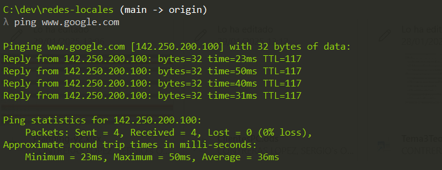
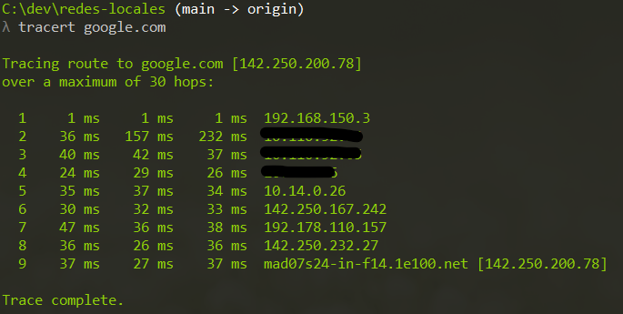

# Casos Prácticos UP3

## Comprobar la conectividad entre máquinas

### El comando ping

Para comprobar la conexión entre redes la herramienta más utilizada es el comando `ping`. Este comando envía mensajes de echo reply esperando el correspondiente mensaje de echo request de vuelta. En su expresión más simple el comando ping sigue la siguiente estructura:

```bash
ping <target-ip | url>
```

Una cuestión importante es que si al utilizar ping no recibimos mensajes de respuesta, esto no significa necesariamente que exista un problema, simplemente que no se ha conseguido la conexión a nivel de red. Muchos administradores deciden colocar cortafuegos que impiden el paso de mensajes ICMP para evitar ataques.

A continuación vemos un ejemplo de verificación de conectividad frente a google.com:



Se observa cómo el dispositivo responde correctamente en unos 20-50 milisegundos al envío de paquetes de 32 bytes. El tamaño y el número de paquetes que se envían desde ping se puede configurar modificando los parámetros del comando.

### El comando traceroute

La otra herramienta típica es traceroute, que nos permite ver la ruta que sigue un paquete desde nuestro dispositivo hasta el destino. En el siguiente ejemplo se muestra la ruta que sigue un paquete desde un dispositivo hasta google.com:



```bash
traceroute [opciones] <destino>  --> Linux
tracert [opciones] <destino>  --> Windows
```

Se pueden observar todas las direcciones IP por donde pasan nuestros paquetes, en las que se nos indica el tiempo que se tarda en llegar a cada uno de los routers. Es importante notar que cada paquete tiene un máximo estipulado de 30 saltos (TTL=30). Si se sobrepasa este límite el paquete se descarta y aparece el error “Destino inalcanzable”.

Existen herramientas visuales que muestran los países por los que pasan nuestros paquetes y la ubicación final del servidor al que se dirige la traza. Un ejemplo de estas herramientas es [Open Visual Traceroute](https://gsuite.tools/traceroute). Es una herramienta de código abierto que permite visualizar gráficamente los saltos que toman los paquetes de datos de nuestro ordenador, mostrando un mapa mundial en 3D o 2D. Esta herramienta es muy útil para entender cómo se mueven los datos a través de la red y para identificar la ubicación final del servidor.

## Configurar la dirección IP en Linux


### Tareas de setup para el ejercicio 

Esto lo vamos a hacer utilizando para ello la VM alpine que encontraréis en: smb://aquituuser@aulainfo2.local/share/Redes/
Copiad alpine1.ova e importarla.

Información adicional para montar el directorio SAMBA: https://www.linode.com/docs/guides/linux-mount-smb-share/

Ejecutar setup-alpine (la distribución por defecto del teclado es la en-us, por  lo que se espera un poco de pericia para escribir el símbolo del guión -) 

Existen dos tipos de asignaciones de direcciones IP.

– IP dinámica: la dirección IP es asignada automáticamente por un servidor DHCP (Dynamic Host Configuration Protocol). Esta dirección puede variar cada vez que se inicia una nueva sesión en el sistema operativo.

– IP fija: la dirección IP y la máscara de subred son asignadas manualmente por el administrador de red. En principio, esta dirección es invariable, a no ser que el propio administrador vuelva a establecer una nueva configuración de red.

Para configurar la dirección IP en Linux desde la consola, debemos seguir los siguientes pasos:

1. Modificar el archivo `interfaces` que se encuentra en la ruta `/etc/network`. Podemos modificarlo con cualquier editor de texto. En el ejemplo, utilizamos `nano`:

```bash
sudo nano /etc/network/interfaces
```

2. Dentro del archivo, si queremos configurar una IP dinámica, incluiríamos las siguientes líneas:

```bash
# Utilizar DHCP para la configuración del adaptador
auto eth0
iface eth0 inet dhcp
```

3. Guardamos el archivo y reiniciamos la red:

```bash
sudo /etc/init.d/networking restart
```

4. El sistema debería responder con un mensaje indicando que los paquetes de intercambio del protocolo DHCP han tenido éxito.

Para establecer una IP estática, también debemos modificar el archivo `/etc/network/interfaces`:

1. Si en el archivo existe alguna línea de configuración dinámica de la interfaz que queremos pasar a estática, deberemos borrarla o comentarla (símbolo `#`).

2. A continuación, especificamos nuestra configuración IP:

```bash
# Configuración de IP estática en eth0
auto eth0
iface eth0 inet static
address 192.168.12.5
gateway 192.168.12.1
netmask 255.255.255.0
network 192.168.12.0
broadcast 192.168.12.255
```

3. Guardamos el archivo y reiniciamos los servicios de red:

```bash
sudo /etc/init.d/networking restart
```

Lo mismo pero en ubuntu based distros:

https://linuxconfig.org/setting-a-static-ip-address-in-ubuntu-24-04-via-the-command-line


### Configurar router mediante CISCO Cli - Gigabit Ethernet Interface

Para configurar una interfaz Gigabit Ethernet en un router Cisco, siga estos pasos:

1. Acceda al modo de configuración global:

```bash
Router> enable
Router# configure terminal
```

2. Configure la interfaz:

```bash
Router(config)# interface gigabitethernet 0/0
```

3. Asigne una dirección IP y una máscara de subred:

```bash
Router(config-if)# ip address 192.168.1.1 255.255.255.0
```

4. Habilite la interfaz:

```bash
Router(config-if)# no shutdown
```

5. Salga del modo de configuración de la interfaz:

```bash
Router(config-if)# exit
```

6. Guarde la configuración:

```bash
Router# copy running-config startup-config
```

<https://www.netacad.com/es/courses/networking-basics?courseLang=es-XL>
